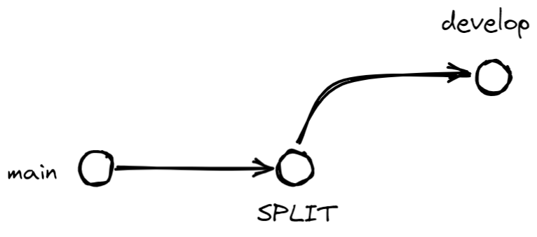

# TeamsManager

# Github Organization
First, click on the **Fork button** in the top-right corner. 

This creates a new copy of this repository under your GitHub user account with a URL like:
```bash
https://github.com/<YourUserName>/TeamsManager
```

---

Next, clone the repo by opening the terminal on your computer and running the command:

```bash
git clone https://github.com/<YourUserName>/TeamsManager.git
```

---

Create a new remote for the upstream repo with the command:
```bash
git remote add upstream https://github.com/vasilecampeanu/TeamsManager
```
Why do I need to do this ?
</br>
Well, when a repository is cloned, it has a default remote called **origin** that points to your fork on GitHub, not the original repository it was forked from. To keep track of the original repository, you need to add another remote named. So, if you want to be able to keep track of the changes that are made by other members of the team you need to complete this step.

---

TeamsManager branches:



Once the repo is cloned, you want to switch to **development** branch. For that, run the following command:

```bash
git checkout develop
```

Why do I need to do this ?
<br>
Because the **main branch** will be preserved only for changes that are tested and stable. Using a development branch is good practice because it kips the main branch clean, macking the end user experience better, by reducing the likelihood of bugs and unintended errors.

Now that you are on the development branch you can make you contribution.

---

After you finised your tasks, you want commit your changes:

```bash
git add *
git commit -m "feat: Your message"
```

After you commited your changes is time to push them to the remote repository:

```bash
git push -u origin develop
```

---

How do i get the changes tht are made by my teammates ?

To pull the changes from the upstream repository run the following command:

```bash
git fetch upstream
git rebase upstream/develop
```